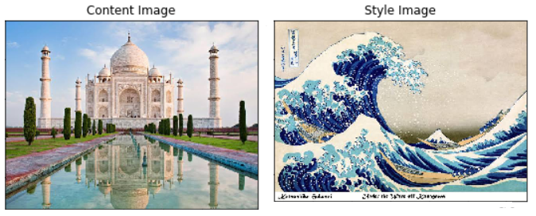
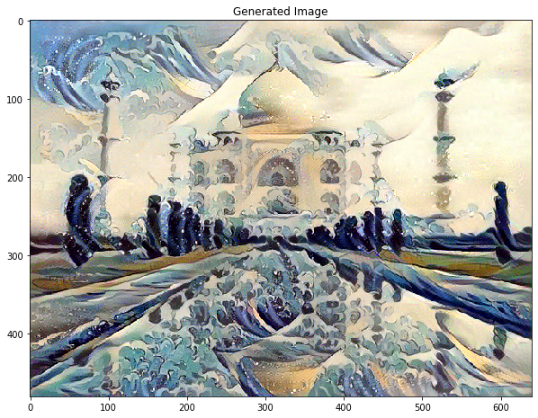

### Files Description
1) _main_colab_notebook.ipynb_         : Jupyter notebook that contains the whole code in one place.
2) _main_image.py_                     : Run Style Transfer on image
3) _main_video.py_                     : Run Style Transfer on Video
4) __ _helpers__.py_                   : Helper function to support the main functions
5) _neural_style_transfer_torch.ipynb_ : PyTorch Implementation of the same _*in progress_

# Neural Style Transfer
Neural Style Transfer (NST) is an optimization technique used to take two images, a content image and a style reference image (such as an artwork by a famous painter) and blend them together such that the generated image is transformed to look like the content image, but “painted” in the style of the style image..

What are we achieving?

